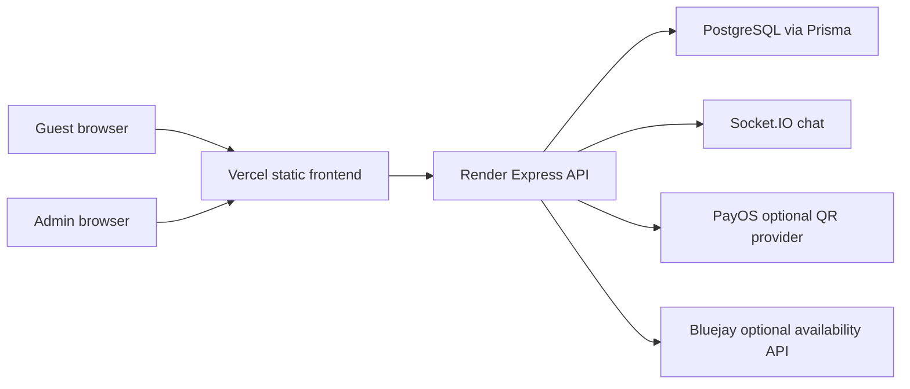

# Lune Production Audit

Audit date: 2026-06-25

## 1. Architecture

## 2. Detected stack

- Frontend: React 19, Vite, React Router, Tailwind CSS.
- Backend: Node.js, Express 5.
- Database: PostgreSQL.
- ORM: Prisma.
- Realtime: Socket.IO.
- Authentication: JWT bearer token for admin, bcrypt password hashing.
- Hosting: Vercel frontend, Render backend, external PostgreSQL.
- File storage: URL/base64/local media placeholder. Production should use object storage.
- Payment: pay-at-property, bank transfer, PayOS QR optional backend integration.
- Email: no production email sender currently detected.
- Analytics: no production analytics script detected.
- Main production URL: `https://www.luneboutiquedanang.com`.

## 3. Request flow

1. Guest opens `www.luneboutiquedanang.com`.
2. Vercel serves static React app.
3. React service layer calls `VITE_API_BASE_URL` or HTTPS production fallback.
4. Express validates input, checks availability/pricing, writes PostgreSQL through Prisma.
5. Admin dashboard calls protected `/api/admin/*` routes with bearer JWT.

## 4. Booking flow

`Home -> Rooms -> Room detail -> Booking -> Payment -> Success`

Backend is the source of truth for:
- date validation;
- room capacity;
- room availability;
- final price;
- payment status.

## 5. Admin login flow

`POST /api/auth/admin/login` validates credentials against `User.passwordHash`, returns JWT. Admin APIs require `requireAuth` and `requireAdmin`.

## 6. Upload/media flow

Current media manager stores URLs in DB. Production upload to server filesystem is not implemented. Use Cloudinary, S3, Firebase Storage, or another object store before allowing real file upload.

## 7. Email flow

No production email sender exists. Booking confirmation is UI/admin based only. Recommended future backend endpoints: booking confirmation email and admin notification email through SMTP/SendGrid/Mailgun.

## 8. Cron/background/webhook

- PayOS webhook placeholder exists at `/api/webhooks/payment/payos`.
- No cron jobs detected.
- No automatic backup job configured in repo.

## 9. Environment variables

Frontend:
- `VITE_API_BASE_URL`
- `VITE_SOCKET_URL`
- `VITE_USE_MOCK_FALLBACK`
- optional mock admin variables for non-production only

Backend:
- `DATABASE_URL`
- `JWT_SECRET`
- `JWT_EXPIRES_IN`
- `CORS_ORIGIN`
- `SOCKET_CORS_ORIGIN`
- `ADMIN_USERNAME`
- `ADMIN_PASSWORD`
- `ADMIN_EMAIL`
- `BLUEJAY_*`
- `PAYOS_*`

## 10. Risk register

| Severity | Finding | Location | Impact | Fix | Status |
|---|---|---|---|---|---|
| Critical | Booking availability was checked before transaction only. | `server/src/modules/bookings/booking.service.js` | Race condition could create overlapping bookings. | Added room row lock, serializable transaction, and re-check before insert. | Fixed |
| High | Booking double submit had no backend idempotency key. | `server/prisma/schema.prisma`, `booking.service.js` | Duplicate bookings from retries/double clicks. | Added nullable unique `idempotencyKey` and frontend header. | Fixed |
| High | Production API fallback could use localhost if Vercel env missing. | `src/config/apiConfig.js` | Broken API or insecure request attempts in production. | Public hosts now default to HTTPS Render API and disable mock fallback. | Fixed |
| High | Public rooms API accepted `status` query. | `server/src/modules/rooms/*` | Hidden rooms could be exposed. | Public rooms always filter `ACTIVE`. | Fixed |
| High | Production 500 errors could expose internal messages. | `server/src/middlewares/errorMiddleware.js` | Information disclosure. | Production 500s now return generic message and request ID. | Fixed |
| Medium | Public media/admin image URLs could store `http://`. | `server/src/modules/media`, `server/src/modules/rooms` | Mixed content and browser security warning. | Added URL sanitizer for public assets. | Fixed |
| Medium | Health endpoint mixed app and DB readiness. | `server/src/app.js` | Harder monitoring semantics. | Added `/api/health` and `/api/ready`. | Fixed |
| Medium | No request ID in logs/errors. | `server/src/app.js` | Harder incident debugging. | Added request context middleware and `X-Request-ID`. | Fixed |
| Medium | No real object storage. | media modules | Uploaded assets are not production durable. | Documented object storage requirement. | Open |
| Medium | No email confirmation provider. | repo-wide | Guests may not receive automatic confirmation. | Documented future integration. | Open |
| Low | CSP still uses `unsafe-inline` for styles due current Tailwind/runtime styles. | `vercel.json` | Lower CSP strictness. | Keep for now; revisit with CSP report-only. | Open |

## 11. Remaining owner actions

1. Apply Prisma migration with backup first.
2. Confirm Render env vars match production domain.
3. Configure real PostgreSQL backup.
4. Configure object storage before real uploads.
5. Decide whether to use PayOS live, bank transfer only, or pay-at-property.
6. Add legal review for privacy/booking terms.
